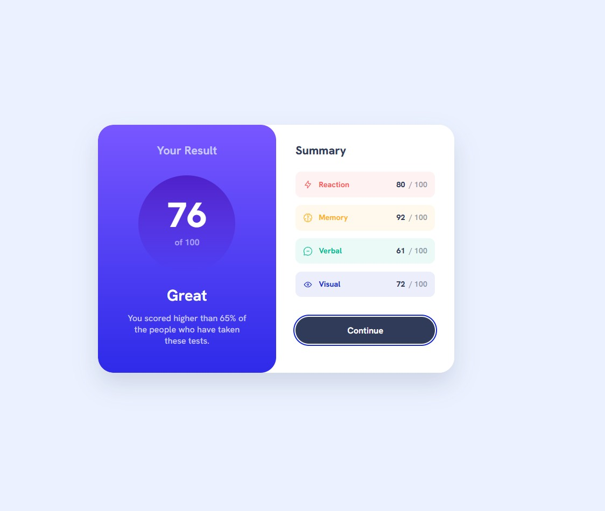

# Frontend Mentor - Results Summary Component Solution

This is my solution to the [Results summary component challenge on Frontend Mentor](https://www.frontendmentor.io/challenges/results-summary-component-CE_K6s0maV). The goal of this challenge was to build a responsive results summary card and use the provided JSON data to render the summary items dynamically.

## Table of contents

* [Overview](#overview)

  * [The challenge](#the-challenge)
  * [Screenshot](#screenshot)
  * [Links](#links)
* [My process](#my-process)

  * [Built with](#built-with)
  * [What I learned](#what-i-learned)
  * [Continued development](#continued-development)
  * [AI Collaboration](#ai-collaboration)
* [Author](#author)

## Overview

### The challenge

Users should be able to:

* View the optimal layout depending on their device screen size
* See hover and focus states for interactive elements
* Display the summary data dynamically from a local JSON file

### Screenshot



### Links

* Solution URL: [Add solution URL here](https://github.com/shigureyn/results-summary-component)
* Live Site URL: [Add live site URL here](https://shigureyn.github.io/results-summary-component/)

## My process

### Built with

* Semantic HTML5 markup
* CSS custom properties
* CSS logical properties
* Flexbox
* CSS Grid
* Mobile-first workflow
* Responsive design
* Local `@font-face`
* Vanilla JavaScript
* Fetch API
* Local JSON data

### What I learned

In this project, I practiced building a responsive component using a mobile-first approach. I also learned how to separate static HTML structure from dynamic data and render the summary list from a local JSON file.

One useful part was generating category modifier classes from JSON data:

```js
function getSummaryItemClass(category) {
  return `summary-item__${category.toLowerCase()}`;
}
```

This allows the JavaScript-rendered elements to use the same CSS classes as the manually written HTML version.

I also practiced using `fetch()` to load local JSON data:

```js
async function renderSummary() {
  const response = await fetch("./data.json");
  const data = await response.json();

  data.forEach((item) => {
    const summaryItem = createSummaryItem(item);
    summaryList.append(summaryItem);
  });
}
```

For accessibility, I used a visually hidden heading for the main card title and kept decorative icons hidden from screen readers:

```html

```

### Continued development

In future projects, I want to continue improving:

* JavaScript DOM rendering
* Working with JSON data
* Accessibility best practices
* Responsive layouts
* CSS organization and naming
* Focus states and keyboard navigation

### AI Collaboration

I used ChatGPT during this project as a learning assistant. It helped me review the HTML structure, improve accessibility, write mobile-first CSS, understand `aria-hidden`, connect local fonts, and implement rendering from a JSON file.

I made the final code decisions myself and used the explanations to better understand each part of the project.

## Author

* GitHub - [@shigureyn](https://github.com/shigureyn)
* Frontend Mentor - [@shigureyn](https://www.frontendmentor.io/profile/shigureyn)
